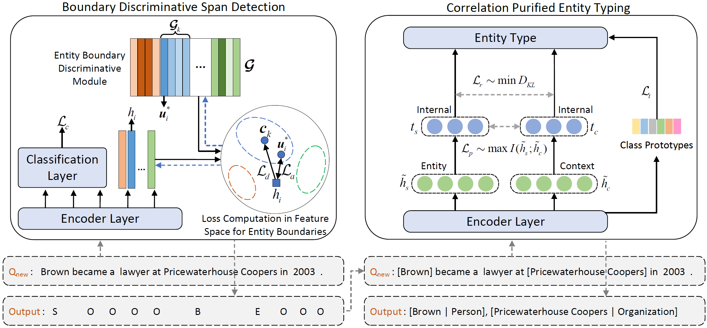

# Robust Few-Shot Named Entity Recognition with Boundary Discrimination and Correlation Purification

This repository contains the codes for the paper "Robust Few-Shot Named Entity Recognition with Boundary Discrimination and Correlation Purification" (AAAI 2024).

_Xiaojun Xue, Chunxia Zhang, Tianxiang Xu, and Zhendong Niu_


## 🎥 Overview

Few-shot named entity recognition (NER) aims to recognize novel named entities in low-resource domains utilizing existing knowledge. However, the present few-shot NER models assume that the labeled data are all clean without noise or outliers, and there are few works focusing on the robustness of the cross-domain transfer learning ability to textual adversarial attacks in few-shot NER. In this work, we comprehensively explore and assess the robustness of few-shot NER models under textual adversarial attack scenario, and found the vulnerability of existing few-shot NER models. Furthermore, we propose a robust two-stage few-shot NER method with Boundary Discrimination and Correlation Purification (BDCP). Specifically, in the span detection stage, the entity boundary discriminative module is introduced to provide a highly distinguishing boundary representation space to detect entity spans. In the entity typing stage, the correlations between entities and contexts are purified by minimizing the interference information and facilitating correlation generalization to alleviate the perturbations caused by textual adversarial attacks. In addition, we construct adversarial examples for few-shot NER based on public datasets Few-NERD and Cross-Dataset. Comprehensive evaluations on those two groups of few-shot NER datasets containing adversarial examples demonstrate the robustness and superiority of the proposed method.



## Installation

Require **python version >= 3.6**, recommend install with `pip`.

```bash
pip3 install -r requirements.txt
```

The code may work on other python and pytorch version. However, all experiments were run in the above environment.

## Training and Evaluation

Here, the training and evaluation are explained using the Few-NERD INTER dataset as an example.

The textual adversarial attack algorithm BERT-Attack (Li et al. 2020) is used to perform synonym substitution and generate adversarial examples.
The codes of BERT-Attack can be found at https://github.com/LinyangLee/BERT-Attack.

```shell
python main.py --mode inter_attack --gpu_device=1 --seed=171 --N=5 --K=1 --similar_k=10 --eval_every_meta_steps=100 --name=10-k_100_2_32_3_max_loss_2_5_BIOES --train_mode=span --inner_steps=2  --inner_size=64  --max_ft_steps=3 --lambda_max_loss=2 --inner_lambda_max_loss=5 --tagging_scheme=BIOES --viterbi=hard --concat_types=None --ignore_eval_test --max_meta_steps 1000
```

```shell
python main.py --seed=171 --gpu_device=1 --lr_inner=1e-4 --lr_meta=1e-4 --mode=inter_attack --N=5 --K=1 --similar_k=10 --inner_similar_k=10 --eval_every_meta_steps=100 --name=10-k_100_type_2_32_3_10_10 --train_mode=type --inner_steps=2 --inner_size=64 --max_ft_steps=3 --concat_types=None --lambda_max_loss=2.0  --max_meta_steps 1000
```

```shell
cp models-5-1-inter/bert-base-uncased-innerSteps_2-innerSize_32-lrInner_0.0001-lrMeta_0.0001-maxSteps_5001-seed_171-name_10-k_100_type_2_32_3_10_10/en_type_pytorch_model.bin models-5-1-inter/bert-base-uncased-innerSteps_2-innerSize_32-lrInner_3e-05-lrMeta_3e-05-maxSteps_5001-seed_171-name_10-k_100_2_32_3_max_loss_2_5_BIOES
```

```shell
python main.py --gpu_device=1 --seed=171 --N=5 --K=1 --mode=inter_attack --similar_k=10 --name=10-k_100_2_32_3_max_loss_2_5_BIOES --concat_types=None --test_only --eval_mode=two-stage --inner_steps=2 --inner_size=64 --max_ft_steps=3 --max_type_ft_steps=3 --lambda_max_loss=2.0 --inner_lambda_max_loss=5.0 --inner_similar_k=10 --viterbi=hard --tagging_scheme=BIOES
```

The seeds are selected from (171 354 550 667 985).


## 🍯 Datasets

- Few-NERD [Ding et al., 2021](https://aclanthology.org/2021.acl-long.248) INTER and INTRA;
- Cross-Dataset [Hou et al., 2020](https://www.aclweb.org/anthology/2020.acl-main.128) for four cross-domain few-shot NER;

## Citation

If you find this repo helpful, please kindly cite the following paper:

```latex
@inproceedings{xue2024dbcp,
  author       = {Xiaojun Xue and
                  Chunxia Zhang and
                  Tianxiang Xu and
                  Zhendong Niu},
  title        = {Robust Few-Shot Named Entity Recognition with Boundary Discrimination and Correlation Purification},
  booktitle    = {AAAI},
  year         = {2024}
}
```

